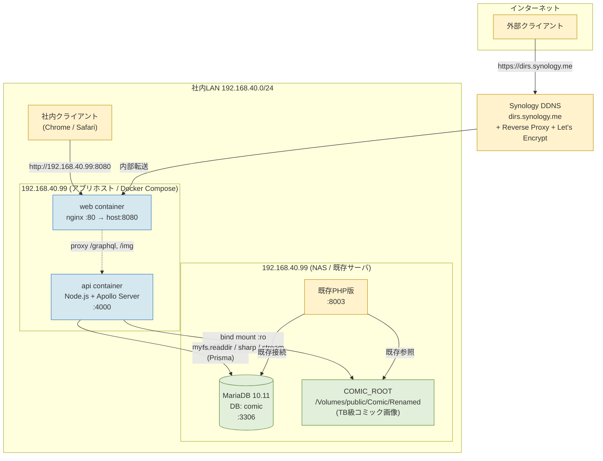
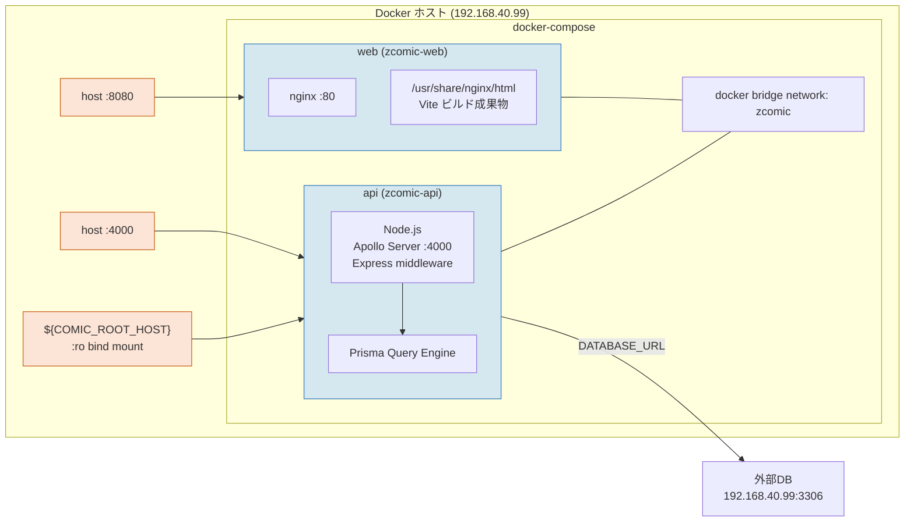
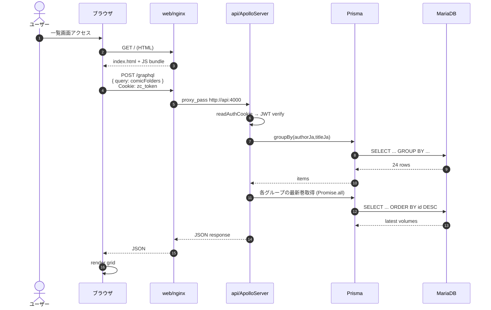
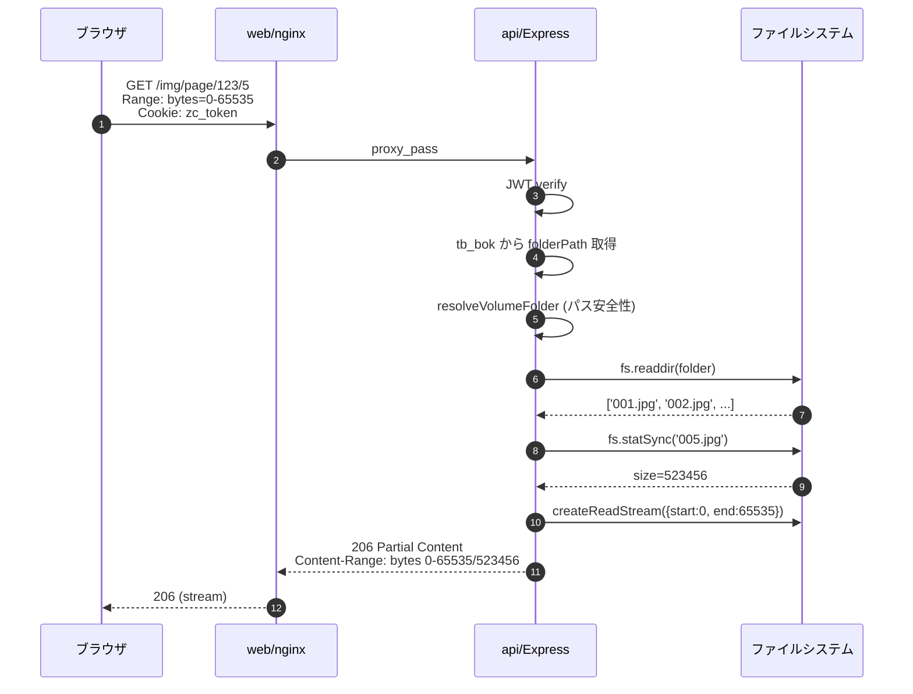
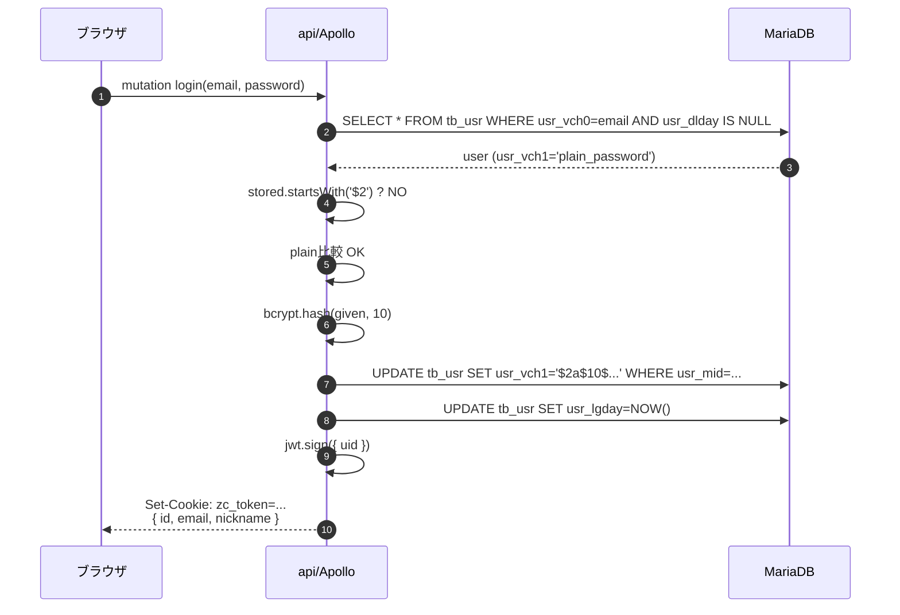

# zcomic-next システム構成図

## 1. 物理構成図



## 2. Docker Compose 構成



## 3. リクエストフロー

### 3.1 GraphQL クエリ（同一オリジン経由）



### 3.2 画像配信 (Range Request)



### 3.3 ログイン + 平文パスワード移行



## 4. 認証経路

```mermaid
flowchart LR
    A[未ログイン] -->|/login へ navigate| B[ログイン画面]
    B -->|LOGIN mutation OK| C[Cookie zc_token 設定]
    C -->|/ へ navigate| D[認証済レイアウト]
    D --> E[me query]
    E -->|me=null| A
    E -->|me={...}| F[グリッド表示]
    F -->|ログアウト| G[clearCookie]
    G --> A
```

## 5. ネットワーク要件

| 接続元 | 接続先 | プロトコル/ポート | 用途 |
|---|---|---|---|
| クライアントPC | 192.168.40.99:8080 | HTTP | 内部アクセス |
| クライアントPC | dirs.synology.me:443 | HTTPS | 外部アクセス（Synology Reverse Proxy） |
| Synology DSM | 192.168.40.99:8080 | HTTP | 内部転送 |
| api コンテナ | 192.168.40.99:3306 | MySQL/TCP | DB接続 |
| api コンテナ | /Volumes/public/Comic/Renamed | ファイルIO | bind mount |
| api コンテナ | (外部不要) | — | — |

## 6. 凡例

| 色 | 種別 |
|---|---|
| 水色 | アプリコンテナ（zcomic 管理対象） |
| 緑色 | 永続データ（DB / FS） |
| 黄色 | 既存・外部システム |

> Mermaid 記法をサポートする Markdown ビューア（VS Code、Obsidian、GitHub、GitLab、Mermaid Live Editor）で開くとレンダリングされます。
