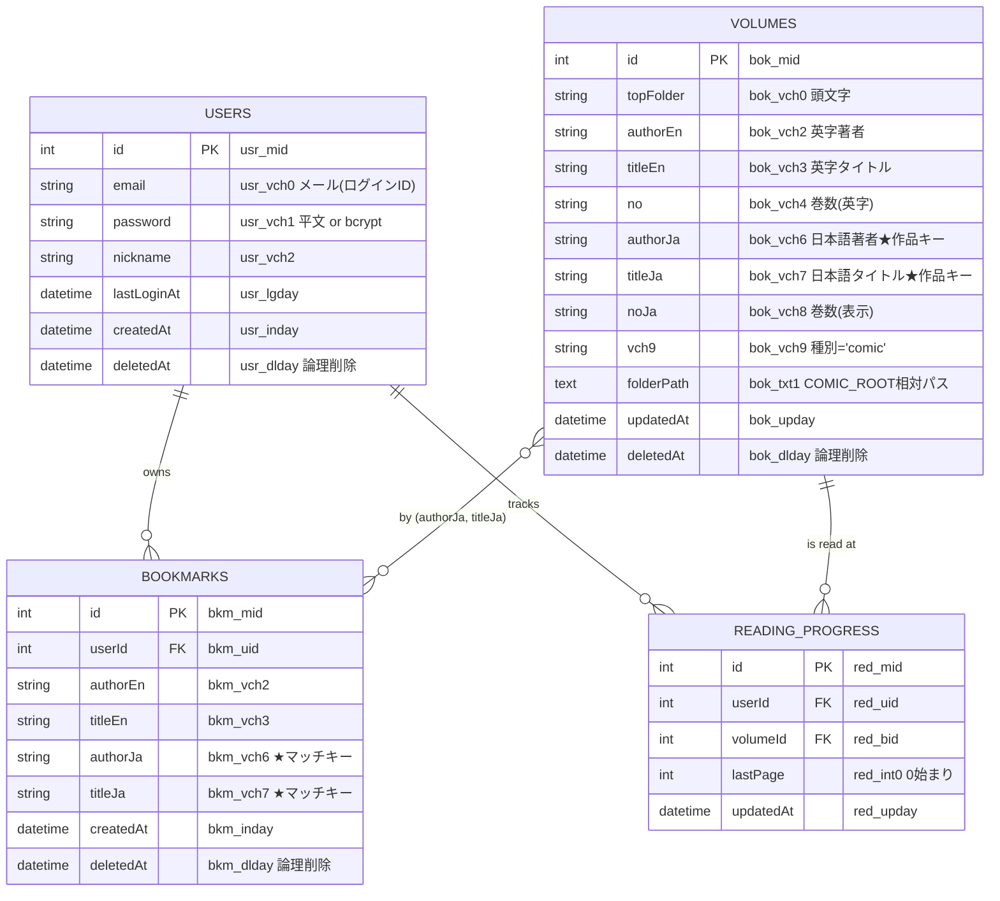
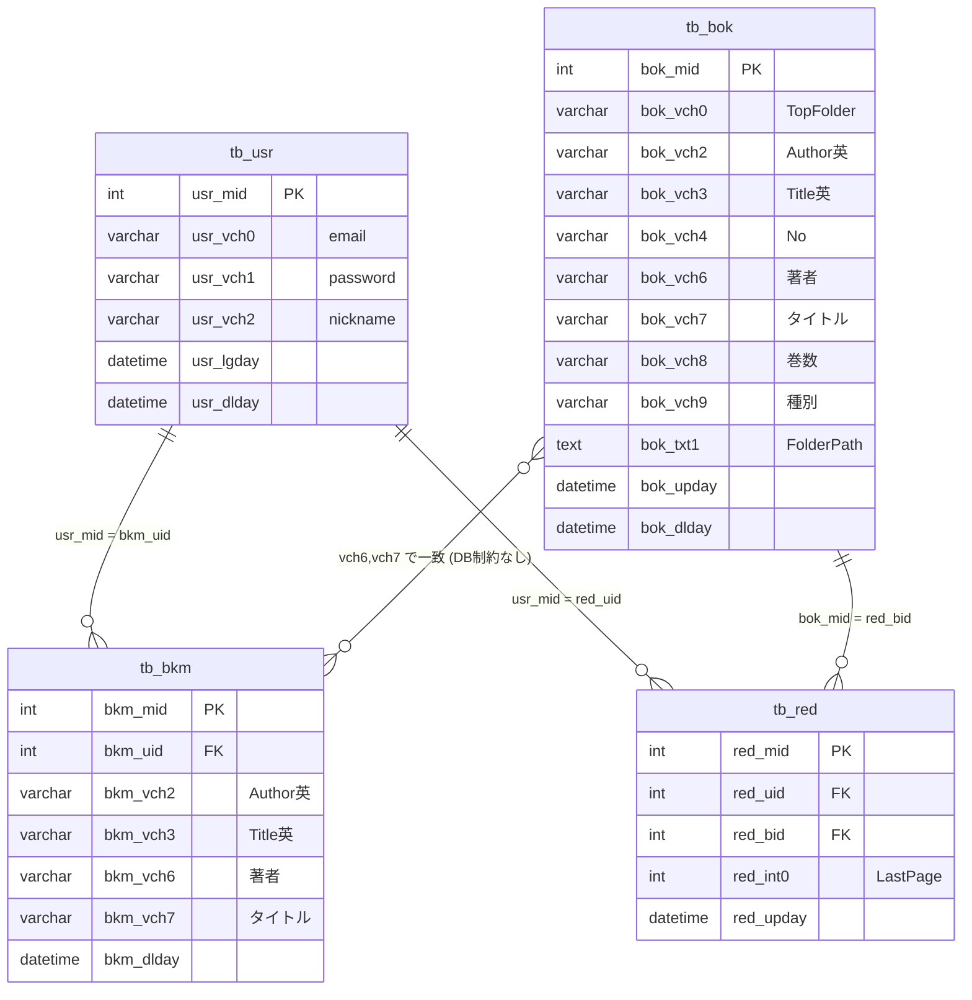

# zcomic-next ER図

## 1. 論理ER図（本システムが使用するテーブルのみ）

## 2. 物理ER図

## 3. リレーション解説

### 3.1 USERS — BOOKMARKS（1:N）

`tb_bkm.bkm_uid` は `tb_usr.usr_mid` を参照（FK定義は無いが論理FK）。1ユーザーが多数のお気入を持つ。

### 3.2 USERS — READING_PROGRESS（1:N）

`tb_red.red_uid` は `tb_usr.usr_mid` を参照（明示FK + ON DELETE CASCADE）。

### 3.3 VOLUMES — READING_PROGRESS（1:N）

`tb_red.red_bid` は `tb_bok.bok_mid` を参照（明示FK + ON DELETE CASCADE）。

### 3.4 VOLUMES — BOOKMARKS（M:N 論理）

直接のFK関係は無く、`(authorJa, titleJa)` の組で論理的に紐づく。

- お気入は **作品単位**（複数巻を含む）
- 同じ作品の複数巻は同じ `(authorJa, titleJa)` を共有

## 4. 重要な制約

| 制約 | 内容 |
|---|---|
| 論理削除 | `*_dlday IS NULL` のみ有効レコードとして扱う |
| 作品の同一性 | `(authorJa, titleJa) = (bok_vch6, bok_vch7)` で同定 |
| 種別フィルタ | `bok_vch9 = 'comic'` のみ本システムで扱う |
| tb_bkm 自動採番なし | INSERT 時に `MAX(bkm_mid) + 1` で採番 |
| tb_red 自動採番あり | `red_mid INT AUTO_INCREMENT` |
| tb_red ユニーク | `UNIQUE (red_uid, red_bid)` でユーザー×巻一意 |

## 5. インデックス

| テーブル | インデックス | 用途 |
|---|---|---|
| tb_usr | PRIMARY (usr_mid) | PK |
| tb_bok | PRIMARY (bok_mid) | PK |
| tb_bok | bok_vch0, bok_vch2, bok_vch3, bok_vch6, bok_vch7, bok_vch4 | 検索・グルーピング |
| tb_bok | bok_upday | 並びリ |
| tb_bkm | PRIMARY (bkm_mid) | PK |
| tb_bkm | bkm_uid, (bkm_vch2, bkm_vch3) | 検索 |
| tb_red | PRIMARY (red_mid) | PK |
| tb_red | UNIQUE (red_uid, red_bid) | upsert |
| tb_red | ix_red_uid, ix_red_bid | 検索 |

## 6. 本システム未使用テーブル（既存・参考）

| テーブル | 用途 | 本システム |
|---|---|---|
| tb_adm | 管理者ユーザー | 未使用 |
| tb_pth | ポイント履歴・購入履歴 | 未使用 |

> Mermaid ER図記法をサポートする Markdown ビューアで開くとレンダリングされます。
