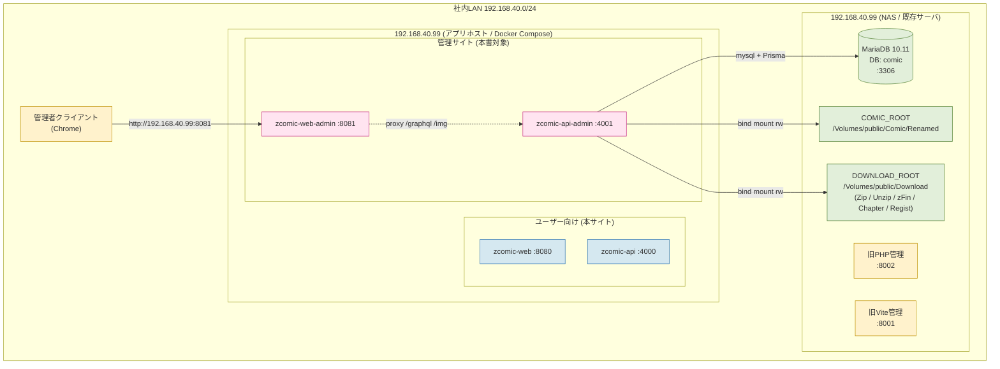
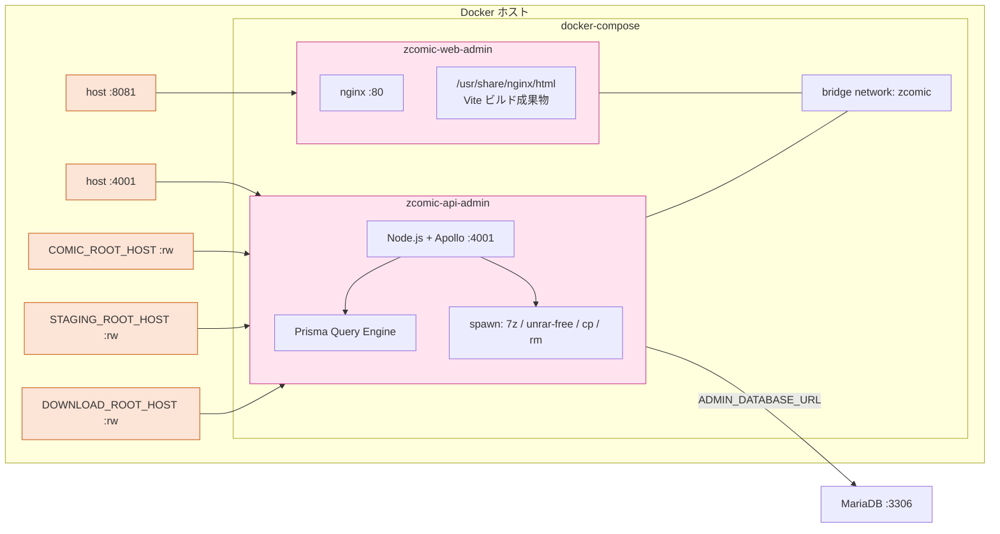
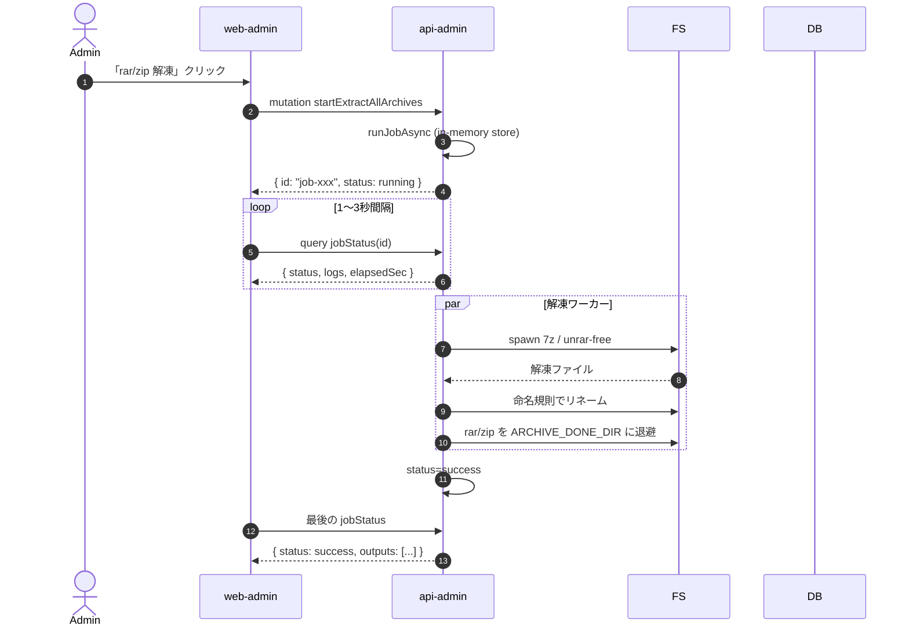
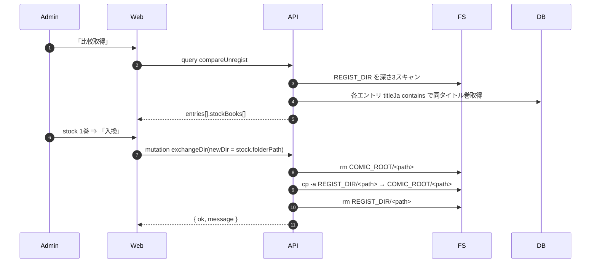
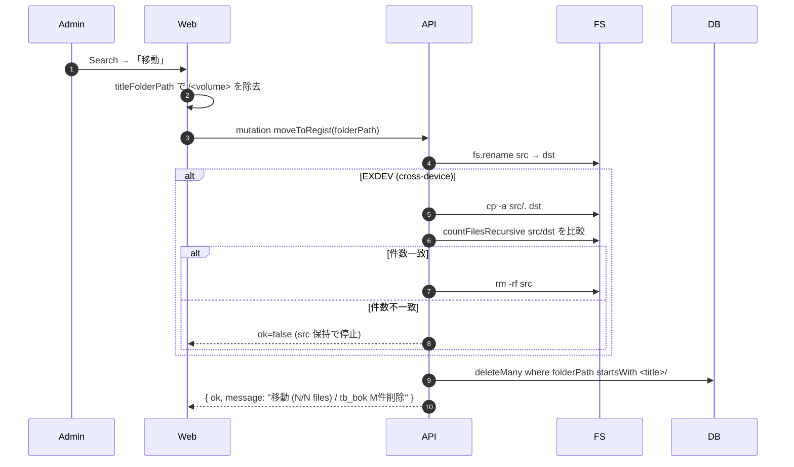

# zcomic-next 管理側 システム構成図

| 文書ID | ZCN-ADM-AR-001 |
|---|---|
| 対象 | apps/api-admin + apps/web-admin |
| 版数 | 1.0 |
| 発行日 | 2026-05-20 |

## 1. 物理構成図



## 2. Docker Compose 構成



## 3. ボリュームマウント

| 環境変数 (ホスト) | コンテナパス | モード | 用途 |
|---|---|---|---|
| `COMIC_ROOT_HOST` (/Volumes/public/Comic/Renamed) | `/comics` | **rw** | 入換・削除のため書き込み必要 |
| `STAGING_ROOT_HOST` (= COMIC_ROOT_HOST) | `/staging` | rw | フォルダ移動・作成の作業領域 |
| `DOWNLOAD_ROOT_HOST` (/Volumes/public/Download) | `/download_root` | rw | `/Zip /Unzip /zFin /Chapter /Regist` を内包 |

DOWNLOAD_ROOT をまとめて1マウントしているのは、`/Zip → /Unzip → /Regist → /comics` のフォルダ移動が **cross-device EXDEV** にならないようにするため。

## 4. リクエストフロー (代表3パターン)

### 4.1 一括解凍ジョブの起動 → ポーリング



### 4.2 比較取得 → stock 入換



### 4.3 検索結果 → タイトル全巻移動 + DB全巻削除



## 5. ネットワーク要件

| 接続元 | 接続先 | プロトコル/ポート | 用途 |
|---|---|---|---|
| 管理者PC | 192.168.40.99:8081 | HTTP | 管理サイト Web |
| web-admin | api-admin:4001 | HTTP | GraphQL proxy |
| api-admin | 192.168.40.99:3306 | MySQL/TCP | DB接続 |
| api-admin | /Volumes/public/Comic/Renamed | ファイルIO (rw) | 入換・削除のため書込必要 |
| api-admin | /Volumes/public/Download/* | ファイルIO (rw) | 解凍・結合・登録作業 |
| api-admin | comic.k-manga.jp | HTTPS | マンガ王国スクレイピング |
| api-admin | 13dl.me | HTTPS | カテゴリクロール |

## 6. 認証経路

```mermaid
flowchart LR
    U[未ログイン] -->|/login へ| L[ログイン画面]
    L -->|adminLogin OK| C[Cookie zc_admin_token]
    C -->|/ へ| Auth[認証済レイアウト]
    Auth --> Me[me query]
    Me -->|me=null| U
    Me -->|me={...}| Home[Home / Unknown / Compare / Page]
    Home -->|logout| Cl[clearCookie]
    Cl --> U
```

> Cookie `zc_admin_token` は本サイトの `zc_token` と完全別物。
> ブラウザ的にも path/scope が異なり、本サイトの認証状態とは完全に独立。
